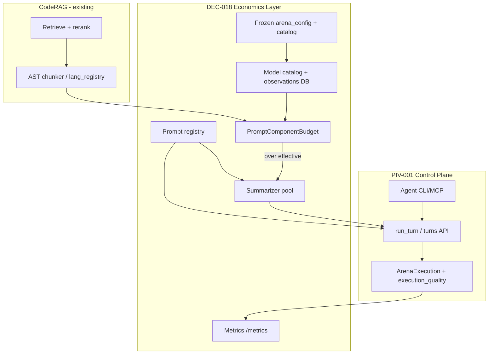

# DEC-018: Model catalog, frozen config, summarizer, prompts

**Status:** accepted · **date:** 2026-07-10  
**Ledger:** [`decision_log.md`](decision_log.md) → `DEC-018`  
**Checklist:** [`piv-001-checklist.md`](piv-001-checklist.md) → Phase 1.5  
**Parent pivot:** [`piv-001-agent-control-plane.md`](piv-001-agent-control-plane.md) (`PIV-001`)

---

## North star

Agents should see a **frozen, vettable contract**: how big each model’s window really is, what we injected, whether compression ran, and whether the turn is acceptable — before treating chairman output as multi-model deliberation.

This extends PIV-001 (agent control plane) with an **economics + observability layer**. Core pivot unchanged: agents drive, UI observes, `ArenaExecution` is the product artifact, disagreement is signal.

**Related decisions:** `DEC-015` (turn API/MCP) · `DEC-016` (model failures) · `DEC-017` (execution_quality gate)  
**Defers:** `DEF-005` synthesis model · `DEF-006` Prom stack · `DEF-007` Graph+N · `DEF-008` UI catalog editor · `DEF-009` ContentChecker OSS

---

## Architecture overview



---

## Config bifurcation + FREEZE

| File | Holds |
|------|--------|
| `data/arena_config.yaml` | RAG caps, safety margin, output allowance, `summarizer_model`, summarize concurrency, catalog refresh TTL, default tag modifiers |
| `data/model_catalog.yaml` | Models **in use**: tags, per-model modifiers, manual overrides, provenance |
| `data/config.json` | UI session state (theme, repo, squad pointer) until migrated |

### FREEZE semantics

- Process loads + validates config **once** at startup (or first `@frozen_config` access).
- Immutable snapshot for PID lifetime — **no mid-flight file re-read**.
- Prevents MCP/async workers from holding two config versions in RAM.
- Config changes require **process restart** (document in settings “requires restart” matrix).
- Pattern borrowed from Bayence Certus `ConfigManager` (`from_yaml`, explicit load) — **not** a dependency on `certus` package.

Squads (`backend/squads/*.json`) remain **composition only** (`arena_models: [...]`). Limits and tags live **only** in `model_catalog.yaml`.

---

## Model catalog & limits

### Three limit layers

| Layer | Source | Authority |
|-------|--------|-----------|
| **Registered** | OpenRouter `GET /api/v1/models` → `context_length` + `model_catalog.yaml` | Default planning; trust OpenRouter at refresh time |
| **Observed** | Runtime max successful `prompt_tokens`, failure telemetry | Wins **only after user acceptance** |
| **Directive** | `@tokenbudget N` | Hard cap; wins over registered |

### Effective limit formula

```
effective_limit = registered_limit × tag_modifier × model_modifier × safety_margin - output_allowance
```

Example: model claims 256k, tag `free` with modifier `0.25` → ~64k before margin/output.

### Tags (extensible sentinels)

- **`free`** — first-class sentinel; default modifier in `arena_config.yaml` (e.g. `0.25`).
- Auto-detect: `:free` suffix, OpenRouter zero pricing where available.
- Manual override in catalog always wins.
- Failure reasons captured as **generic strings** initially; promote to internal **enum** (`RATE_LIMIT`, `PRIVACY_BLOCKED`, `CONTEXT_EXCEEDED`, …) for automated action. Rate limit ⇒ retry/wait, not shrink context.

### Observation vetting gate

Observations are first-class but **data is not authoritative until accepted**.

1. On squad/plan selection (CLI/MCP/UI): compare observed vs registered; **flag if ≥10% delta** either direction.
2. Present pending observations; user **accept** or **decline**.
3. Only **accepted** rows promote to live `observed_limit`.
4. **TTL 60 days** → re-verify (re-check delta; compare official drift vs previous registered).
5. **History:** append-only + archive tables. Remove from live only when archive row matches live on **every column** (no silent datatype drift).

**Phase A:** schema + stub tables. **Phase B:** refresh job + acceptance API.

---

## Summarizer service

| Role | Phase 1.5 | Future (`DEF-005`) |
|------|-----------|---------------------|
| **Summarizer** | Optional `summarizer_model`; chairman fallback + structured log | — |
| **Chairman** | Final synthesis only | — |
| **Synthesis model** | — | Reserved nullable `synthesis_model` in schema |

### Rules

- **Fresh session** every call: `messages: [{role: user, content}]` — no arena thread, no prior turns.
- Summarizer receives **target token/word budget + target model id** — does not look up catalog itself.
- **Per-model** threshold → individual `SummarizeJob` when that model’s prompt exceeds **its** effective limit.
- **Shared min target** only when `@summarize` forces squad-wide compression.
- **Concurrency:** `len(arena_models) - 1`, chairman **excluded** from pool.
- Optional dedup cache on identical `(context_hash, target, prompt_version)` — fresh session semantics preserved.

### Summarizer modes (`prompt_id`)

| `prompt_id` | Use |
|-------------|-----|
| `context.summarize.rag` | Compress RAG block in light of user + mode |
| `context.summarize.user` | Compress user input alone |
| `mid_turn.semantic` | Between-stage semantic compression (council/fight) |

Today’s chairman-only path in `backend/budget.py` maps to `context.summarize.rag` with chairman fallback.

---

## Prompt registry

All system-injected strings move to a registry:

| `prompt_id` | Today’s location |
|-------------|------------------|
| `context.summarize.rag` | `budget.py` |
| `rag.control` | `context_engine.py` `CONTROL_PROMPT` |
| `council.stage1` / `rank` / `chair` | `arena.py` |
| `round_robin.turn` | `arena.py` `run_mode_round_robin` |
| `mode.*` | `directives.py` |

Each entry: `prompt_id`, `version`, `mode`, `template`, `variables`.

**Expose:** `GET /api/prompts`, MCP `list_system_prompts` / `get_system_prompt`, bounded metric label `prompt_id`.

**Umbrella concept:** `SystemInjection` — anything assembled that isn’t raw user/RAG content. Owned by Context Engine; mode runners consume rendered slices.

---

## Token budget — `PromptComponentBudget`

Per turn, per model, per mode — first-class components:

| Component | Examples |
|-----------|----------|
| `rag` | Retrieved chunks (pre/post cap, post-summarize) |
| `system` | Registry injections |
| `mode` | RR turn block, fight phases |
| `turn` | Prior draft / prior stage context |
| `user` | Clean query |
| `directives` | Cite, length hints |

Persisted as `BudgetDecision` in turn metadata. Fixes RR wrapper bloat: mode+system overhead visible even when RAG is compressed.

### RAG pre-cap (before summarize)

- Modest default chunk cap (configurable per model in catalog).
- **AST-aware boundaries:** `backend/rag/lang_registry.py` (tree-sitter class/function nodes); line-window fallback on parse failure.
- **Structure-aware compression:** port TokenJam `wrap.py` / `detect.py` wrap/restore gate (`DEF-009` tracks standalone **ContentChecker** OSS).
- **Graph+N after BGE:** `DEF-007`. Until then: cap post-rerank bundle, summarize if still over effective limit.

---

## Metadata & quality

### New records (turn metadata)

- **`BudgetDecision`** — per model: official/effective limits, modifiers, component token breakdown, summarized flag.
- **`SummarizeJob`** — summarizer used, chairman fallback, duration_ms, input/output tokens, `prompt_id`, cache_hit, outcome.

### Extend `execution_quality` (`DEC-017`)

Add: `summarize_failures[]`, `budget_decisions[]`, `observation_pending[]`, `summarizer_used_chairman`.

---

## Observability (`DEF-006` stack deferred)

Phase 1.5 ships **instrumentation only** — counters/histograms, `/metrics` exposition. No Prom/Victoria/Grafana deploy yet.

**Rules:** accumulation over raw per-event series; no high-cardinality labels (`conversation_id` bad; `mode`, `prompt_id`, `tag` ok).

| Metric | Type |
|--------|------|
| `arena_turns_total` | counter (`mode`, `quality_severity`) |
| `arena_model_failures_total` | counter (`status_class` enum) |
| `arena_prompt_tokens` | histogram (`component`) |
| `arena_summarize_duration_seconds` | histogram (`prompt_id`, `cache_hit`) |
| `arena_summarize_jobs_total` | counter (`outcome`) |
| `arena_catalog_limit_delta` | gauge (pending observation) |
| `arena_config_freeze_generation` | counter (bump on restart) |

---

## Phasing

### Phase A — Contracts (first build stack)

- YAML schemas + FREEZE loader
- Prompt registry + migrate core strings
- Catalog loader (registered limits + tag modifiers; replaces hardcoded `MODEL_CONTEXT_LIMITS`)
- `summarizer_model` + chairman fallback log
- `BudgetDecision` / `SummarizeJob` metadata hooks
- Extend `execution_quality`
- `/metrics` starter endpoint
- Unit tests

### Phase B — Behavior

- Per-model parallel summarize pool
- OpenRouter catalog refresh job
- Observation DB + CLI/MCP acceptance gate
- RAG pre-cap + structure-aware summarize port (minimal TokenJam wrap)

### Phase C — Intelligence

- Observation TTL / re-verify workflow
- Failure enum promotion + automated recommendations
- UI catalog editor (`DEF-008`)

---

## Code anchors (current baseline)

| Area | Path |
|------|------|
| Summarizer today | `backend/budget.py` — chairman-only, shared cache |
| AST chunking | `backend/rag/lang_registry.py` |
| Structure preserve (port source) | `tokenjam/.../core/summarize/wrap.py`, `detect.py` |
| Settings today | `data/config.json`, `backend/dependencies.py` |
| Quality gate | `backend/execution_quality.py`, `mcp_arena/quality.py` |
| Certus pattern reference | `Bayence-Certus/certus/config/manager.py` |

---

## Precedence & contradictions resolved

| Topic | Resolution |
|-------|------------|
| Per-model vs shared summarize | Per-model on auto threshold; shared min only for `@summarize` |
| Chairman dual role | Summarizer ≠ chairman in hot path; fallback logged |
| Official vs observed | Observed wins only after user acceptance |
| `@tokenbudget` | Hard cap over registered; does not disable catalog math |
| Nine parallel summarize jobs | Pool + per-job record + optional dedup cache |
| Metrics cardinality | Histograms/counters; bounded labels |

---

## CLI / MCP surface (target)

| Command / tool | Purpose |
|----------------|---------|
| `arena config validate` | Validate frozen YAML |
| `arena catalog refresh` | Pull OpenRouter registered limits |
| `arena catalog effective-limits --squad normal` | Show computed limits + pending observations |
| `list_system_prompts` / `get_system_prompt` | Prompt registry |
| Plan selection warnings | Surface ≥10% observation deltas before turn |